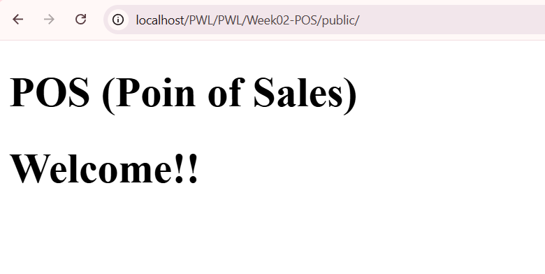
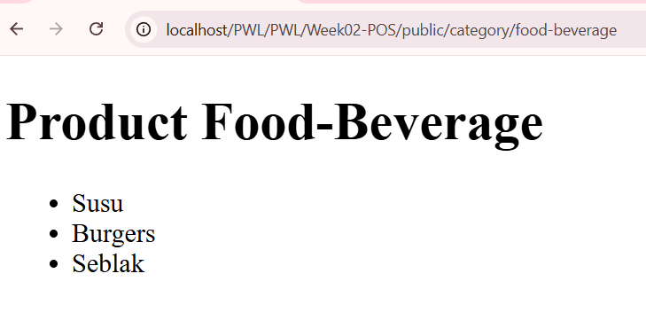
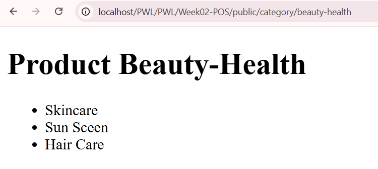
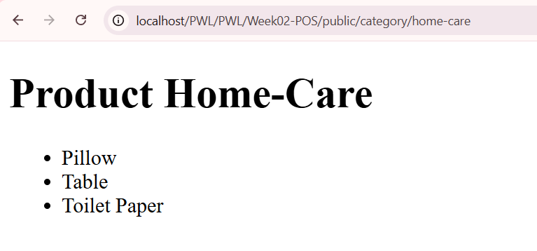
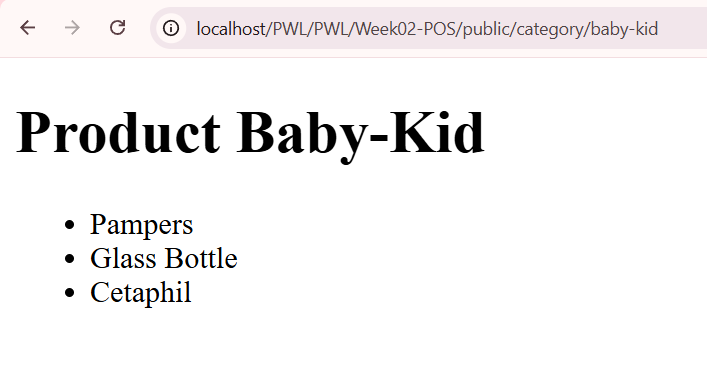
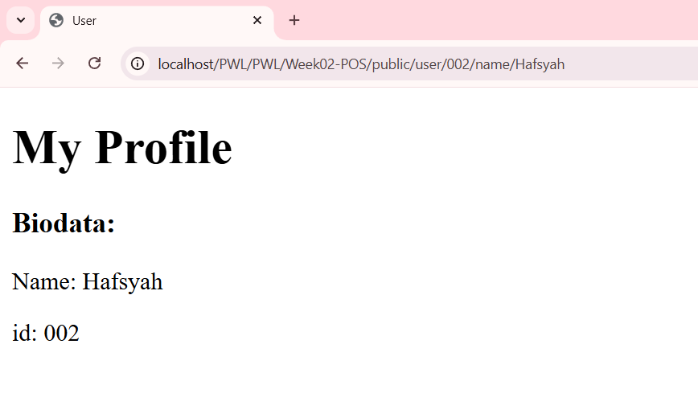
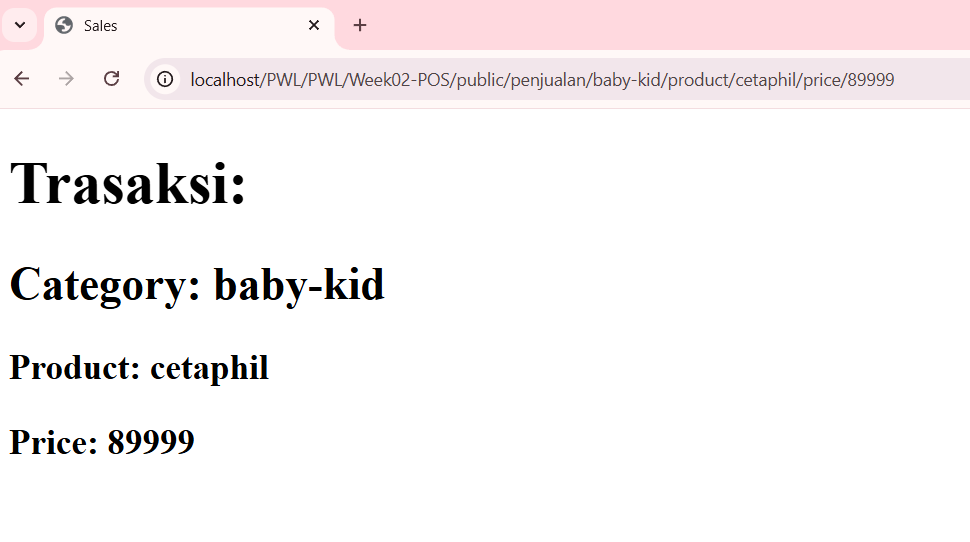

# SOAL PRAKTIKUM JOBSHEET 02
## Routing, Controller, dan View

---

### Identitas Mahasiswa
| Keterangan | Detail |
| :--- | :--- |
| **Nama** | Mufliha Hafsyah Shahieza |
| **NIM** | 244107020147 |
| **Kelas** | TI-2F |

---
### Dokumentasi Praktikum

<b>SOAL PRAKTIKUM : APLIKASI POS</b>

 
<blockquote>

**Aplikasi Point of Sales (POS)**

1. **Halaman Home**
   Menampilkan ringkasan utama aplikasi.
   

2. **Halaman Products (Category)**
   Menampilkan daftar produk berdasarkan kategori menggunakan route prefix.
   
   
   
   

3. **Halaman User**
   Menampilkan profil pengguna berdasarkan ID dan Nama.
   

4. **Halaman Penjualan (Transactions)**
   Menampilkan antarmuka transaksi penjualan.
   

</blockquote>

---

Tahun Akademik 2025/2026
