# PEMROGRAMAN WEB LANJUT - JOBSHEET 02
## Routing, Controller, dan View

---

### Identitas Mahasiswa
| Keterangan | Detail |
| :--- | :--- |
| **Nama** | Mufliha Hafsyah Shahieza |
| **NIM** | 244107020147 |
| **Kelas** | TI-2F |

---

### Dokumentasi Praktikum
*Klik pada judul bagian untuk melihat hasil screenshot.*

 

<b>PRAKTIKUM 1 : ROUTE</b>

 
<blockquote>

**Membuat Route '/hello'**
Pada tahap ini dilakukan pembuatan route get dengan URL/hello, akan menampilkan teks 'Hello World'.
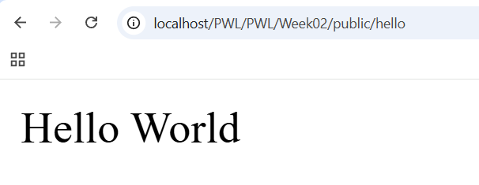

**Menambahkan Route '/world'**
Pada tahap ini dilakukan pembuatan route dasar untuk menampilkan teks 'World'.
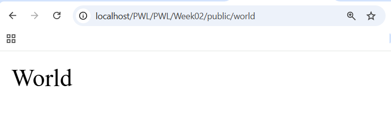

**Mengubah Route '/'**
Pada tahap ini dilakukan pembuatan route dasar untuk menampilkan pesan 'Selamat Datang'.
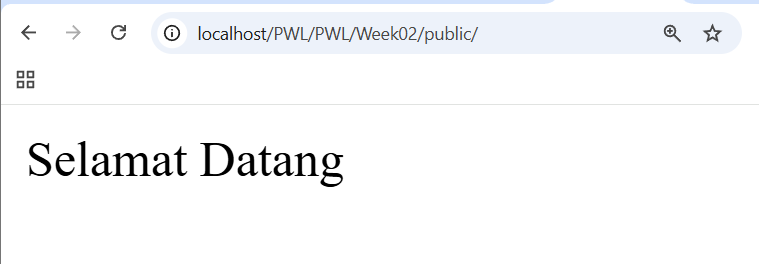

**Membuat Route '/about'**
Pada tahap ini dilakukan pembuatan route dasar untuk menampilkan identitas mahasiswa (NIM dan Nama).
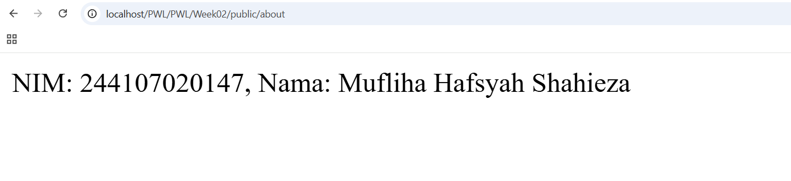

**Membuat Route '/user/{name}'**
Pada tahap ini dilakukan pembuatan route dasar untuk menampilkan teks 'Nama saya NamaAnda'.
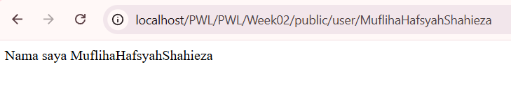

**Membuat Route '/user/'**
Pada tahap ini halaman akan menampilkan 'error not found'.
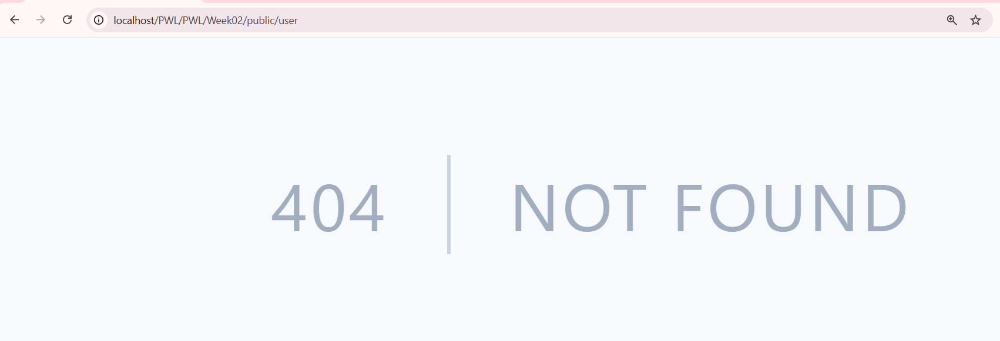

**Membuat Route yang menerima parameter $postId dan juga $comment.**
Pada tahap ini halaman akan menampilkan 'Post ke- Komentar ke- '.
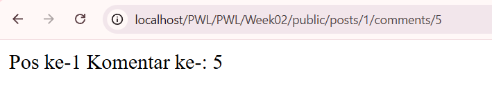

**Membuat Route '/articles/{id}/'**
Pada tahap ini halaman akan menampilkan 'Halaman Artikel dengan ID {id}'.
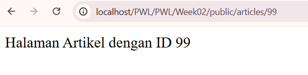

**Memanggil Route '/user' sekaligus mengirimkan parameter $name yang bersifat opsional (null).**
Pada tahap ini halaman akan menampilkan 'Nama saya '.
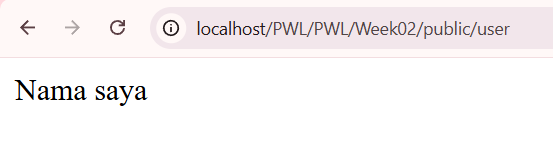

**Memanggil Route '/user' sekaligus mengirimkan parameter $name yang bersifat opsional(not null).**
Pada tahap ini halaman akan menampilkan 'Nama saya NamaAnda'.
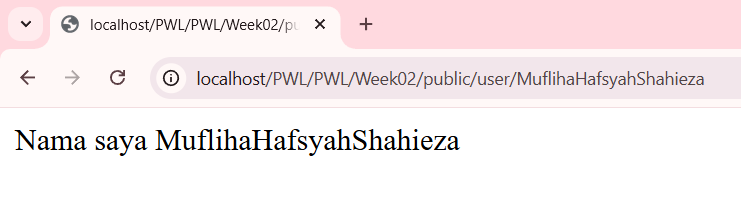

**Implementasi Optional Parameter**
Pada tahap ini halaman akan menampilkan 'Nama saya John' karena parameter $nama nilai defaultnya adalah 'John'.
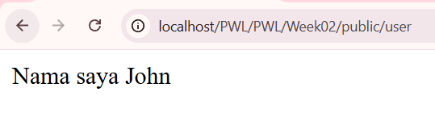

</blockquote>

 

<b>PRAKTIKUM 2 : CONTROLLER</b>

 
<blockquote>

**Pembuatan Welcome Controller**
Pemindahan logika dari file route ke dalam WelcomeController untuk merapikan struktur kode.
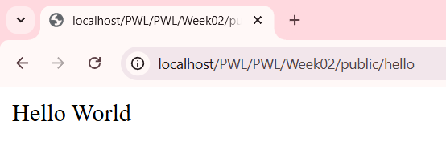

**Page Controller '/'**
Pembuatan PageController yang menangani beberapa halaman sekaligus (Home, About, dan Articles).
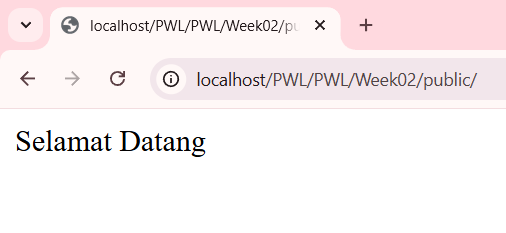

**Page Controller '/about/'**
Pembuatan PageController yang menangani beberapa halaman sekaligus (Home, About, dan Articles).
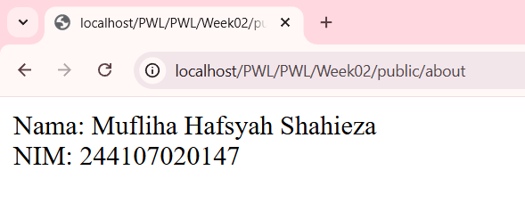

**Page Controller '/articles/'**
Pembuatan PageController yang menangani beberapa halaman sekaligus (Home, About, dan Articles).
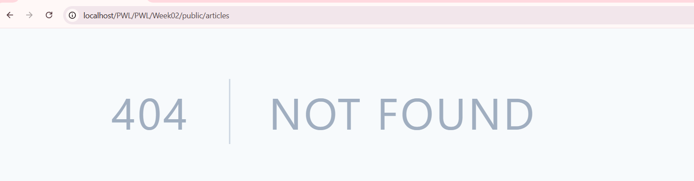

**Page Controller '{id}'**
Pembuatan PageController yang menangani beberapa halaman sekaligus (Home, About, dan Articles).
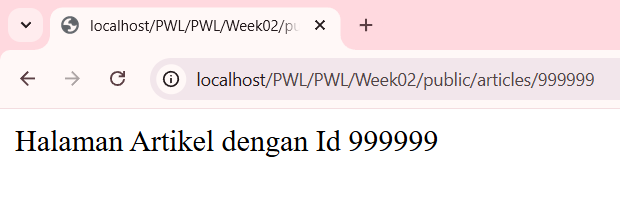

**Single Action Controller**
Hasil akhir yang didapatkan akan ada HomeController, AboutController dan ArticleController
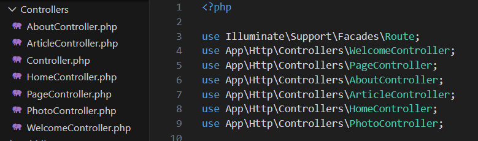

**Resource Controller**
Implementasi PhotoController menggunakan tipe Resource untuk menangani fungsi CRUD secara otomatis.
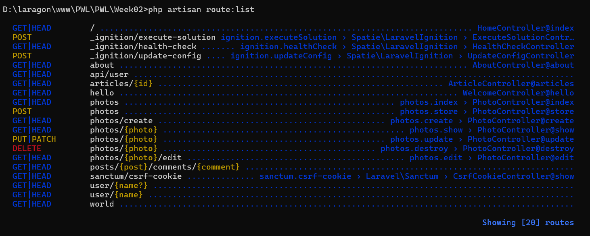

</blockquote>

 

<b>PRAKTIKUM 3 : VIEW</b>

 
<blockquote>

**Implementasi Blade View**
Pada tahap ini, dibuat file hello.blade.php di dalam folder resources/views. Pengamatan menunjukkan bahwa untuk menampilkan struktur HTML yang kompleks, kita harus menggunakan View daripada hanya mengembalikan string dari rute atau controller.
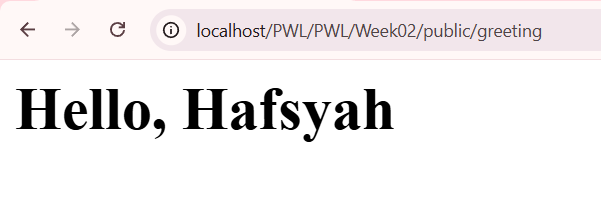

**Organisasi View dalam Sub-folder**
File view diletakkan di dalam sub-folder blog. Pengamatan menunjukkan cara pemanggilannya di controller menggunakan notasi titik (blog.hello). Hal ini sangat berguna untuk merapikan file tampilan dalam proyek skala besar.
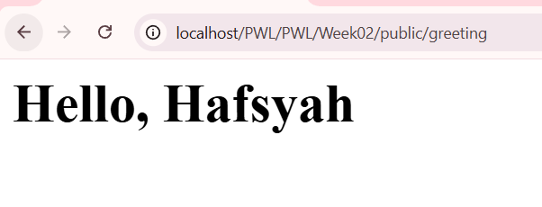

**Passing Data ke View**
Dilakukan pengiriman variabel dari Controller ke View menggunakan method with(). Hasil pengamatan menunjukkan bahwa data dapat ditampilkan secara dinamis menggunakan sintaks kurung kurawal ganda {{ $variable }} milik mesin template Blade.
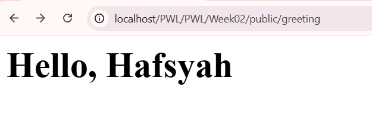

</blockquote>

 

<b>TUGAS MANDIRI: APLIKASI POS</b>

 
<blockquote>

**Laporan Hasil Pembuatan Project Point of Sales (POS):**

1. **Halaman Home**
   Menampilkan ringkasan utama aplikasi.
   

2. **Halaman Products (Category)**
   Menampilkan daftar produk berdasarkan kategori menggunakan route prefix.
   

3. **Halaman User**
   Menampilkan profil pengguna berdasarkan ID dan Nama.
   

4. **Halaman Penjualan (Transactions)**
   Menampilkan antarmuka transaksi penjualan.
   

</blockquote>

---

Tahun Akademik 2025/2026
