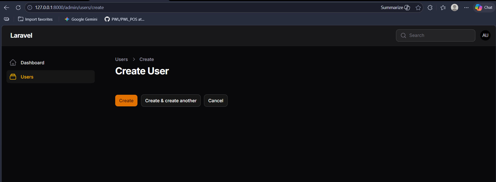
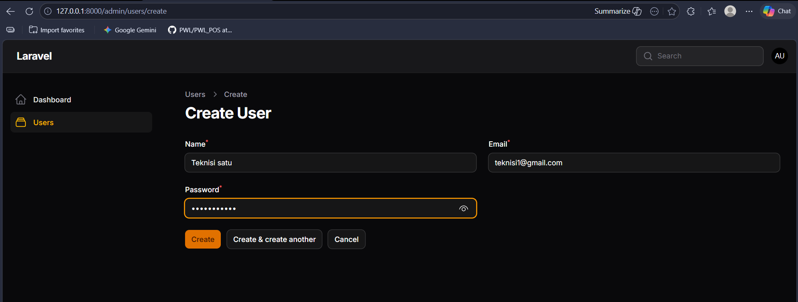
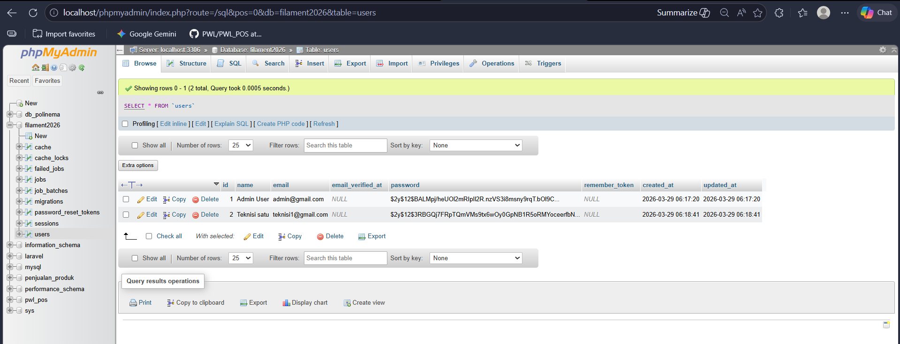
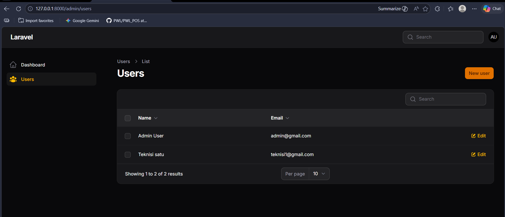
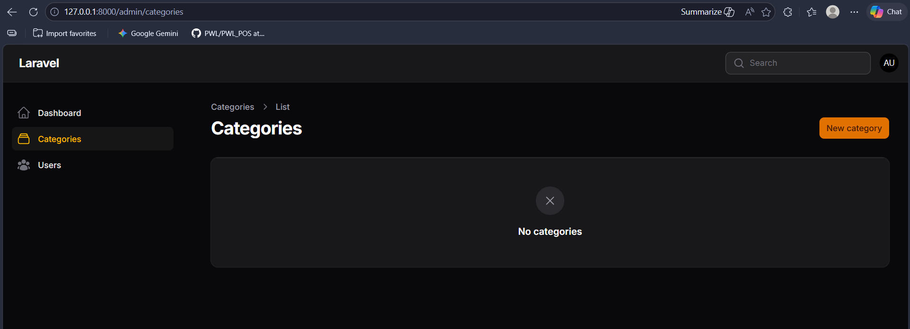
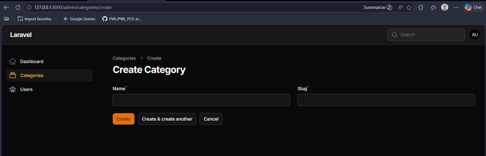
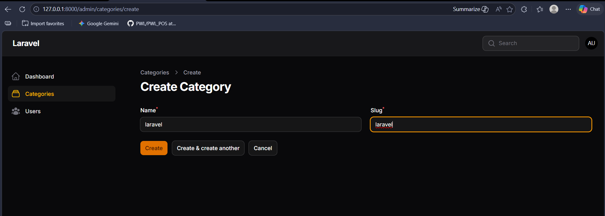
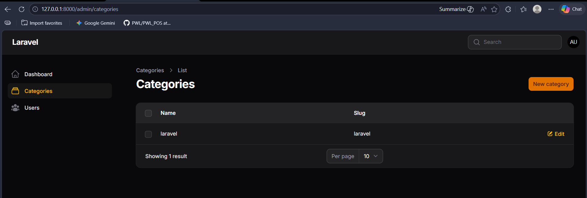

# LAPORAN PRAKTIKUM - WEEK 05 PEMROGRAMAN WEB LANJUT

---

### Identitas Mahasiswa
| Keterangan | Detail |
| :--- | :--- |
| **Nama** | Mufliha Hafsyah Shahieza |
| **NIM** | 244107020147 |
| **Kelas** | TI-2F |

---

## JOBSHEET 1 Instalasi dan Setup Filament PHP v4 pada Laravel 11

### Dokumentasi Praktikum
 

<b>Hasil Praktikum</b>

 
<blockquote>

</blockquote>

 

<b>Analisis & Diskusi</b>

 
<blockquote>

**1. Apa kelebihan Filament dibanding membuat admin panel manual?**
Jawab : 
Penggunaan Filament sebagai framework untuk panel admin menawarkan efisiensi yang signifikan dibandingkan metode pengembangan manual. Keunggulan utamanya terletak pada aspek produktivitas, di mana fitur-fitur esensial seperti Create, Read, Update, Delete (CRUD), sistem pencarian (search), filter data, serta paginasi telah tersedia secara out-of-the-box. Hal ini meminimalkan penulisan kode berulang (boilerplate code) pada sisi Controller dan View. Selain itu, Filament menjamin konsistensi antarmuka pengguna (UI) karena menggunakan standar desain Tailwind CSS yang modern dan responsif, serta telah mengimplementasikan praktik keamanan terbaik sesuai standar ekosistem Laravel terbaru.

**2. Mengapa Filament menggunakan Livewire?**
Jawab : 
Filament mengadopsi Livewire sebagai basis teknologinya untuk menyajikan pengalaman pengembangan full-stack yang reaktif tanpa memerlukan kompleksitas framework JavaScript eksternal seperti React atau Vue. Livewire memungkinkan komponen pada panel admin berinteraksi secara dinamis, seperti validasi formulir secara real-time dan pembaruan data tanpa pemuatan ulang halaman (page refresh), hanya dengan menggunakan logika PHP. Hal ini menyederhanakan struktur kode dan mempercepat proses sinkronisasi antara logika bisnis di sisi server dengan tampilan di sisi client.

**3. Apa perbedaan SQLite dan MySQL dalam development?**
Jawab : 
Perbedaan mendasar antara SQLite dan MySQL terletak pada arsitektur dan skalabilitasnya:

- Arsitektur: SQLite merupakan database berbasis file tunggal yang tersimpan secara lokal di dalam direktori proyek, sehingga sangat portabel dan tidak memerlukan proses instalasi server yang rumit. Sebaliknya, MySQL adalah sistem manajemen database relasional (RDBMS) berbasis client-server yang memerlukan layanan servis terpisah untuk beroperasi.

- Konfigurasi: SQLite tidak memerlukan konfigurasi pengguna (username) atau kata sandi (password) pada tahap pengembangan awal. MySQL memerlukan pengaturan kredensial dan port khusus (biasanya melalui Laragon atau XAMPP).

- Penggunaan: SQLite lebih optimal digunakan untuk tahap prototyping, pengujian (testing), atau aplikasi dengan skala data kecil. MySQL lebih diprioritaskan untuk lingkungan produksi (production) yang menangani trafik tinggi dan konkurensi data yang kompleks.

**4. Apa fungsi Panel Builder?**
Jawab : 
Panel Builder merupakan komponen inti dalam ekosistem Filament yang berfungsi sebagai orkestrator utama untuk mengelola seluruh sumber daya (resources), halaman kustom (custom pages), dan dasbor dalam satu kesatuan navigasi yang terintegrasi. Secara fungsional, Panel Builder memungkinkan pengembang untuk membangun beberapa panel administrasi yang berbeda dalam satu aplikasi Laravel yang sama (misalnya: memisahkan antara Panel Admin, Panel Vendor, dan Panel Pelanggan) dengan konfigurasi, otentikasi, dan hak akses yang spesifik bagi masing-masing peran pengguna.

</blockquote>

 

---

## JOBSHEET 2 Membuat CRUD Resource dengan Filament v4

### Dokumentasi Praktikum
 

<b>Hasil Praktikum</b>

 
<blockquote>

**Menjalankan Aplikasi**

**Membuat Form Input (Create & Edit)**

**Menampilkan Data pada Tabel**

**Mengganti Icon Menu Resource**

</blockquote>

 

<b>Analisis & Diskusi</b>

 
<blockquote>

**1. Mengapa Filament dapat membuat CRUD tanpa banyak coding?**
Jawab : 
Filament menggunakan konsep Resource yang mengintegrasikan Model Laravel dengan komponen antarmuka secara otomatis. Dengan mendefinisikan skema pada satu file Resource, Filament secara cerdas menghasilkan halaman daftar (List), formulir tambah (Create), serta halaman ubah (Edit) tanpa perlu membangun Controller dan View secara manual satu per satu.

**2. Apa perbedaan Form Schema dan Table Schema?**
Jawab : 
- Form Schema: Berfungsi untuk mendefinisikan struktur inputan pada halaman tambah dan ubah data. Fokusnya adalah pada jenis komponen input (seperti TextInput, Select, FileUpload) dan aturan validasi data yang masuk.

- Table Schema: Berfungsi untuk mengatur tampilan data pada halaman daftar (List). Fokusnya adalah pada kolom mana yang ingin ditampilkan (seperti TextColumn, ImageColumn), pengaturan pengurutan (sorting), fitur pencarian, serta filter data.

**3. Bagaimana jika kita ingin menambahkan validasi email unik?**
Jawab : 
Validasi email unik dapat ditambahkan pada komponen TextInput di dalam form() menggunakan fungsi berantai (chained method) unique(). 
- Contoh implementasinya:
Forms\Components\TextInput::make('email')->email()->required()->unique(ignoreRecord: true)
Parameter ignoreRecord: true penting ditambahkan agar validasi unik tidak menyebabkan error saat kita sedang mengedit data yang sama.

**4. Mengapa password tidak perlu kita hash manual?**
Jawab : 
Dalam standar Filament v4, secara default pengamanan kata sandi sudah ditangani secara otomatis melalui Model User yang menggunakan trait HasPassword atau melalui pengaturan pada skema formulir. Filament akan mendeteksi field password dan melakukan hashing menggunakan algoritma Bcrypt atau Argon2 sebelum data disimpan ke dalam database, sehingga menjamin integritas keamanan tanpa intervensi manual dari pengembang.

</blockquote>

 

---

## JOBSHEET 3 Membuat Migration, Model, Relasi & Resource Category

### Dokumentasi Praktikum
 

<b>Hasil Praktikum</b>

 
<blockquote>

**Mendesain Tabel Categories**

**Membuat Resource Category di Filament**

</blockquote>

 

<b>Analisis & Diskusi</b>

 
<blockquote>

**1. Mengapa kita perlu $fillable?**
Jawab : 
$fillable digunakan untuk menentukan kolom mana saja yang diizinkan untuk diisi secara massal (mass assignment). Hal ini merupakan fitur keamanan Laravel untuk mencegah pengguna mengirimkan data berbahaya (seperti mengubah status is_admin secara ilegal) melalui form input.

**2. Apa fungsi $casts pada Laravel?**
Jawab : 
$casts berfungsi untuk mengonversi tipe data dari database ke tipe data yang kita inginkan di PHP secara otomatis. Contohnya, kolom yang di database bertipe string "true/false" bisa di-cast menjadi boolean murni di Laravel agar lebih mudah diolah dalam logika pemrograman.

**3. Apa perbedaan integer biasa dengan foreign key?**
Jawab : 
- Integer biasa: Hanya menyimpan angka tanpa ada keterikatan dengan tabel lain.

- Foreign Key: Adalah kolom yang menjadi "jembatan" atau referensi ke Primary Key di tabel lain. Foreign key menjaga integritas data agar tidak ada Post yang merujuk ke Category yang tidak eksis.

**4. Bagaimana jika category dihapus tetapi masih ada post?**
Jawab : 
Hal ini bergantung pada pengaturan foreign key constraint yang digunakan:

- Cascade: Jika kategori dihapus, maka semua post di bawahnya ikut terhapus otomatis.

- Set Null: Jika kategori dihapus, kolom category_id di tabel post akan berubah jadi NULL.

- Restrict (Default): Laravel/MySQL akan menolak penghapusan kategori selama masih ada post yang terhubung dengannya.

</blockquote>

 

--- 

Tahun Akademik 2025/2026
