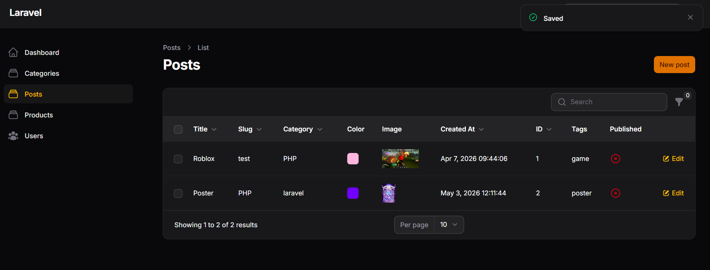
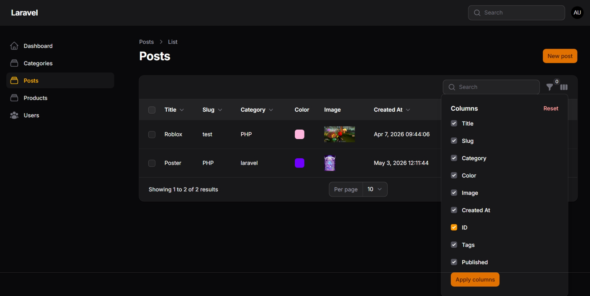
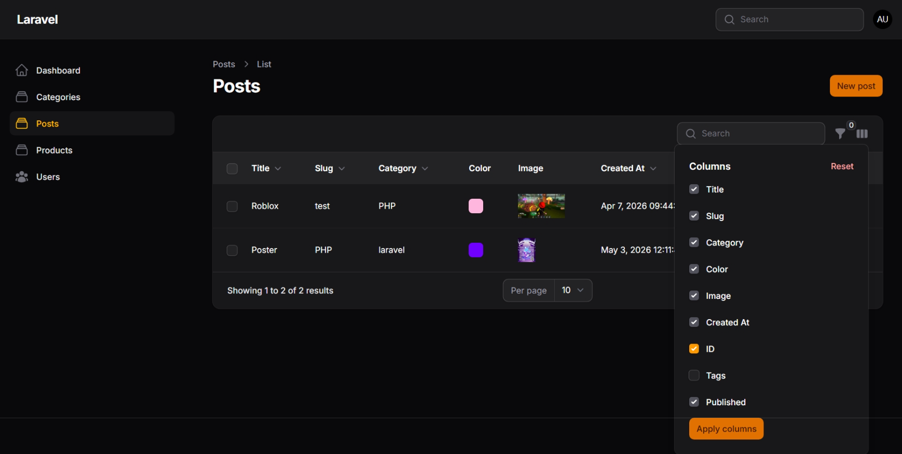
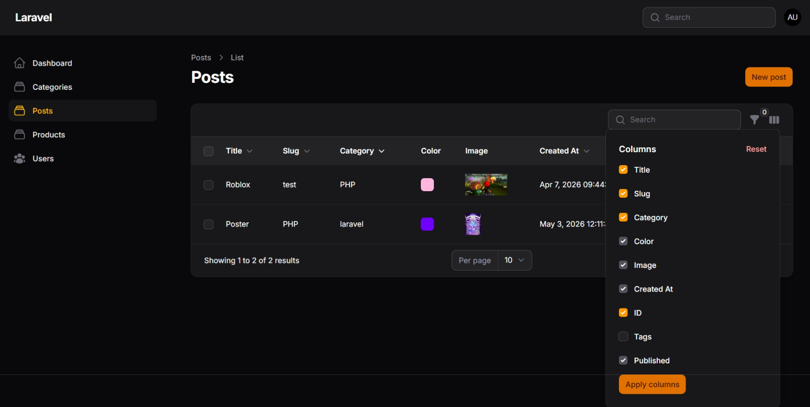

# LAPORAN PRAKTIKUM - WEEK 12 PEMROGRAMAN WEB LANJUT

---

### Identitas Mahasiswa
| Keterangan | Detail |
| :--- | :--- |
| **Nama** | Mufliha Hafsyah Shahieza |
| **NIM** | 244107020147 |
| **Kelas** | TI-2F |

---

## JOBSHEET WEEK 12 

### Implementasi Toggle Column pada Table Filament
 

<b>Hasil Praktikum</b>

 
<blockquote>

**Menambahkan Kolom ID, Kolom Tags, Kolom Published**
 
**Mengaktifkan Toggle Column**
 
**Menyembunyikan Kolom Secara Default**
 
**Menerapkan Toggle pada Semua Kolom**
 

</blockquote>

 

<b>Analisis & Diskusi</b>

 
<blockquote>

**1. Mengapa toggle column penting pada admin panel?**
 
Jawab : 

- Optimasi Ruang Tampilan (UI/UX): Admin panel sering kali menangani model data yang memiliki banyak kolom (seperti Image, Title, Slug, Category, dll.). Jika semua ditampilkan sekaligus, tabel akan menjadi penuh (crowded), padat, dan sulit dibaca. Toggle column menjaga tampilan tetap rapi.  
- Fleksibilitas Pengguna: Setiap admin atau staf memiliki fokus data yang berbeda saat bekerja. Fitur ini memberikan kebebasan bagi user untuk mempersonalisasi kolom mana saja yang relevan dengan kebutuhan kerja mereka saat itu.  
- Peningkatan Efisiensi: Mengurangi beban kognitif pengguna dalam menyaring informasi secara visual pada layar yang padat, sehingga mempercepat proses manajemen data.

**2.  Apa perbedaan toggleable() biasa dengan isToggledHiddenByDefault?**
 
Jawab : 
 

- ->toggleable() biasa: Mengaktifkan fitur agar kolom tersebut bisa disembunyikan atau ditampilkan oleh user melalui menu pengaturan kolom. Namun secara default (saat halaman pertama kali dimuat), kolom ini tetap langsung terlihat di tabel. 
- ->toggleable(isToggledHiddenByDefault: true): Kolom tersebut tetap memiliki fitur toggleable, tetapi status awalnya saat halaman pertama kali dibuka adalah tersembunyi (tidak tampil). User harus membuka menu toggle dan mencentangnya secara manual jika ingin memunculkannya kembali.  

**3. Mengapa preferensi kolom tetap tersimpan?**
 
Jawab : 
 

- Penyimpanan Berbasis Session: Filament secara otomatis mendeteksi dan menyimpan perubahan konfigurasi visibilitas kolom yang dilakukan oleh pengguna ke dalam komponen state management bawaan berbasis Session di sisi server.  
- Persistensi Data: Karena disimpan di dalam session, data preferensi tersebut tidak akan hilang ketika pengguna melakukan refresh halaman, berpindah ke menu lain, atau kembali lagi ke halaman daftar Post tersebut selama masa session webnya belum habis (expire). 

**4. Kapan sebaiknya kolom disembunyikan secara default?**
 
Jawab : 
 

- Data Opsional/Sekunder: Kolom yang berisi informasi tambahan yang jarang digunakan dalam operasional sehari-hari, contohnya data meta seperti ID, Slug, atau timestamps detail.  
- Kolom Berukuran Besar atau Panjang: Kolom yang memuat teks narasi panjang (seperti isi konten, excerpt, atau kumpulan tags yang banyak) yang berpotensi merusak struktur lebar tabel.  
- Keterbatasan Layar: Ketika jumlah total kolom utama sudah melebihi batas ideal visual layar standar, sehingga kolom penunjang sengaja disembunyikan untuk menjaga estetika halaman utama.  

</blockquote>

 

---

Tahun Akademik 2025/2026
