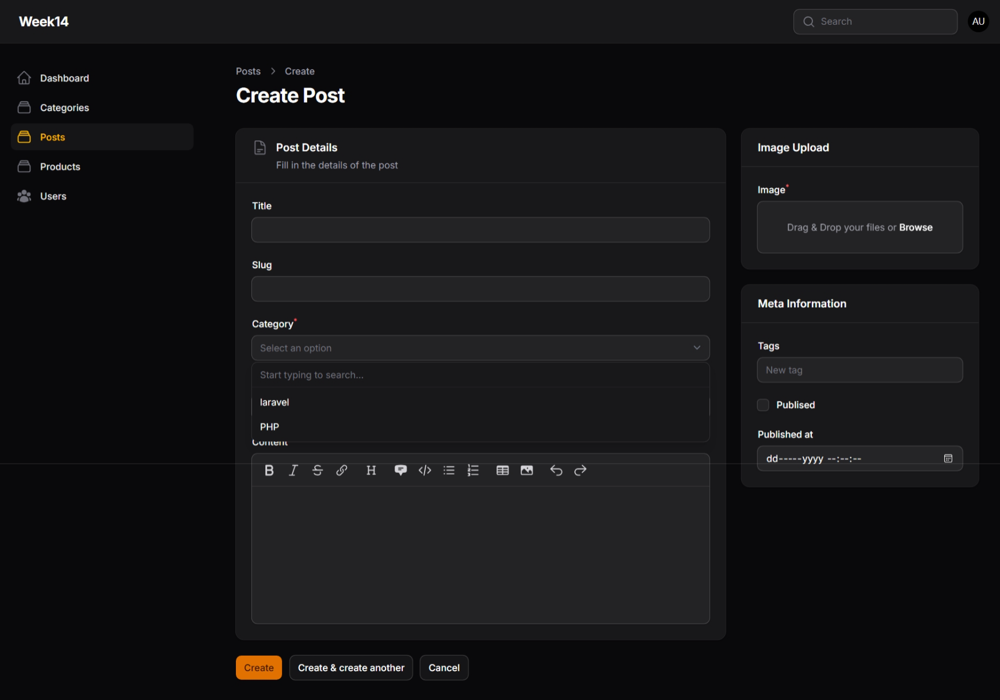
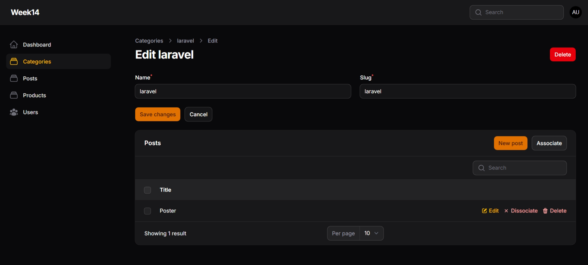
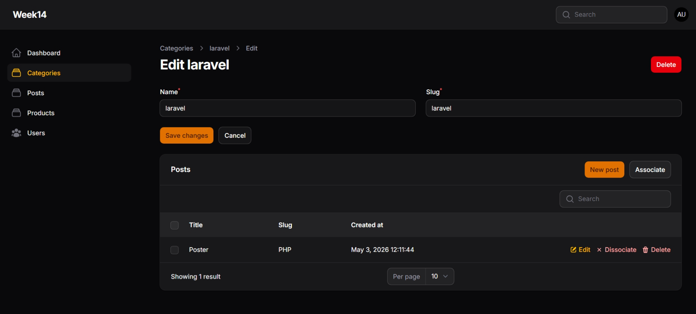
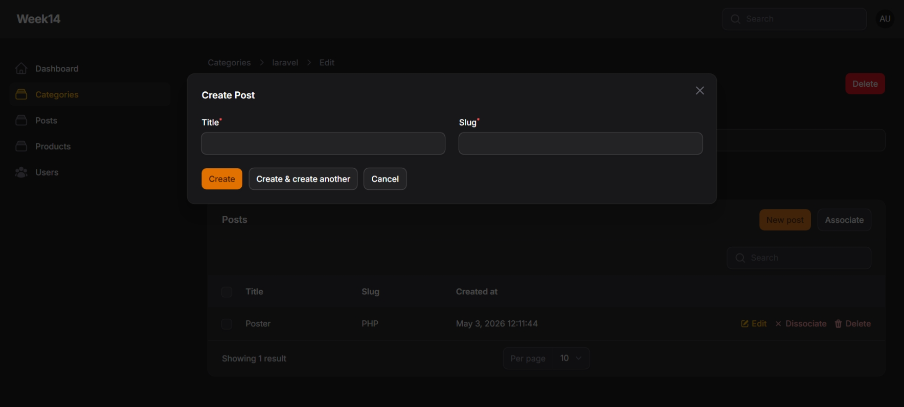

# LAPORAN PRAKTIKUM - WEEK 14 PEMROGRAMAN WEB LANJUT

---

### Identitas Mahasiswa
| Keterangan | Detail |
| :--- | :--- |
| **Nama** | Mufliha Hafsyah Shahieza |
| **NIM** | 244107020147 |
| **Kelas** | TI-2F |

---

## JOBSHEET WEEK 14

### Implementasi Relation pada Filament (HasMany)
 

<b>Hasil Praktikum</b>

 
<blockquote>

**Membuat Dropdown Searchable**
 
**Menghubungkan Relationship Manager**
 
**Menambahkan Kolom pada Relationship Table**
 
**Membuat Form Create Post pada Relationship**
 

</blockquote>

 

<b>Analisis & Diskusi</b>

 
<blockquote>

**1. Apa perbedaan relationship() dengan options()?**
 
Jawab : 

- ->relationship('nama_relasi', 'field_tujuan'): Method ini secara otomatis membaca relasi Eloquent yang didefinisikan pada model Laravel. Filament akan melakukan querying ke database untuk mengambil data relasi secara dinamis, mengelola penyimpanan foreign key otomatis, dan mendukung pencarian server-side (searchable).  
- ->options([...]): Method ini digunakan untuk memberikan daftar pilihan statis atau hasil array manual (misalnya menggunakan kumpulan data konstan atau manual Model::all()->pluck()). Kelemahannya adalah Filament tidak mengetahui ikatan relasi antar-model secara langsung dan seluruh data dipaksa dimuat sekaligus ke dalam memori aplikasi sejak awal.  

**2.  Mengapa searchable penting untuk dataset besar?**
 
Jawab : 
 

- Efisiensi Memori & Performa (Lazy Loading): Jika sebuah tabel memiliki ribuan data relasi (misalnya ribuan kategori atau produk), menggunakan dropdown biasa akan memuat semua data tersebut sekaligus, membuat loading halaman menjadi sangat lambat (overhead). Fitur ->searchable() membuat Filament hanya memuat data ketika pengguna mengetik kata kunci pencarian.  
- Pengalaman Pengguna (UX) yang Lebih Baik: Memudahkan pengguna admin untuk menemukan data spesifik dengan cepat melalui pencarian teks daripada harus menggulir (scrolling) daftar dropdown yang sangat panjang.  

**3. Apa fungsi Relationship Manager pada Filament?**
 
Jawab : 
 

- Pengelolaan Data Relasi Terpusat (CRUD Inline): Memungkinkan admin panel untuk mengelola data anak (child records) langsung dari dalam halaman detail/edit data induk (parent record) tanpa harus berpindah halaman resource.  
- Otomatisasi Foreign Key: Saat membuat data baru melalui modul modal di Relationship Manager, properti kunci asing (foreign key seperti category_id) akan otomatis terisi mengikuti konteks data induk yang sedang dibuka.

**4. Kapan menggunakan HasMany dan BelongsTo?**
 
Jawab : 
 

- HasMany (Satu ke Banyak): Digunakan pada model Induk yang memiliki atau mengayomi banyak data anak. Contoh: Model Category memiliki fungsi posts() dengan relasi hasMany(Post::class) karena satu kategori bisa menampung banyak artikel.  
- BelongsTo (Banyak ke Satu): Digunakan pada model Anak yang menyimpan kolom foreign key dari data induk. Contoh: Model Post memiliki fungsi category() dengan relasi belongsTo(Category::class) karena setiap artikel hanya terikat pada satu kategori spesifik saja.  

</blockquote>

 

---

Tahun Akademik 2025/2026
