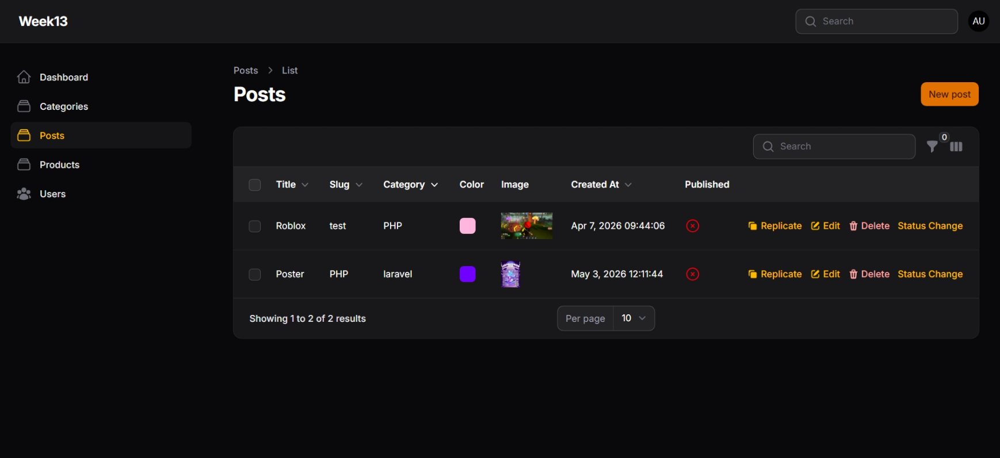
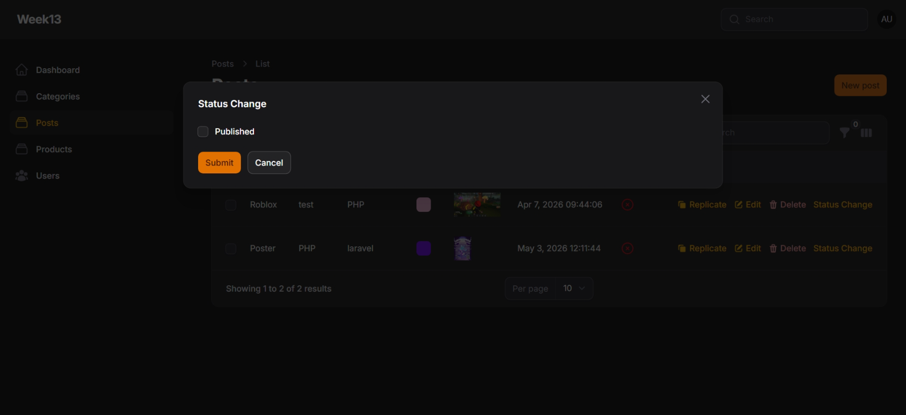

# LAPORAN PRAKTIKUM - WEEK 14 PEMROGRAMAN WEB LANJUT

---

### Identitas Mahasiswa
| Keterangan | Detail |
| :--- | :--- |
| **Nama** | Mufliha Hafsyah Shahieza |
| **NIM** | 244107020147 |
| **Kelas** | TI-2F |

---

## JOBSHEET WEEK 1

### Implementasi Relation pada Filament (HasMany)
 

<b>Hasil Praktikum</b>

 
<blockquote>

**Membuat Dropdown Searchable**
 
**Menghubungkan Relationship Manager**
 
**Membuat Custom Action (Ubah Status Publish)**
 
 
 

</blockquote>

 

<b>Analisis & Diskusi</b>

 
<blockquote>

**1. Mengapa action di tabel lebih efisien dibanding halaman edit?**
 
Jawab : 

- Memangkas Jumlah Klik (Less Clicks): Pengguna dapat mengeksekusi aksi instan seperti menghapus (DeleteAction) atau menggandakan data (ReplicateAction) langsung dari baris tabel tanpa perlu menunggu proses loading berpindah ke halaman edit terlebih dahulu.  
- Menghemat Waktu Operasional: Admin dapat mengelola banyak data secara cepat di satu halaman utama, mengurangi beban kerja server untuk rendering halaman formulir edit yang terpisah.  
- Metode Pembaruan In-Place: Memungkinkan modifikasi data minor (seperti mengubah visibilitas lewat modal status change) secara langsung, sehingga alur kerja (workflow) manajemen data menjadi jauh lebih mulus.

**2.  Apa perbedaan predefined action dan custom action?**
 
Jawab : 
 

- Predefined Action: Aksi siap pakai bawaan dari Filament (contohnya EditAction, DeleteAction, ReplicateAction) yang sudah otomatis mengemas fungsi logika dasar database, komponen UI, ikon standar, dan dialog konfirmasinya sendiri dari sistem.  
- Custom Action: Aksi modifikasi mandiri menggunakan Action::make() di mana kita sebagai pengembang mendefinisikan sendiri nama aksi, skema form internal (->schema()), ikon visual, hingga logika eksekusi manipulasi data yang spesifik di dalam fungsi penanganan callback (->action()).  

**3. Bagaimana cara menambahkan validasi dalam custom action?**
 
Jawab : 
 

Validasi form di dalam modal custom action Filament dapat diterapkan langsung pada komponen input yang ada di dalam method ->schema(). Caranya adalah dengan merantai (chaining) method validasi standar Filament Form pada komponen input tersebut, misalnya:
  
Action::make('status')
    ->schema([
        Checkbox::make('published')
            ->rules(['required', 'boolean']), 
    ])
  
Selain itu, kita juga bisa menggunakan method seperti ->required(), ->reactive(), atau kustomisasi fungsi penutupan (closure validation) langsung pada field formulir di dalam modal sebelum fungsi ->action() dijalankan.

**4. Kapan kita menggunakan Replicate?**
 
Jawab : 
 

Aksi ReplicateAction sangat ideal digunakan pada situasi berikut:  
- Duplikasi Data Berpola Sama: Ketika admin perlu membuat data baru yang mayoritas isinya sangat mirip atau identik dengan data lama yang sudah ada, sehingga tidak perlu mengetik ulang dari awal.  
- Pembuatan Template Post/Produk: Jika sistem memiliki konten dasar atau draft berulang; admin cukup menyalin (copy) data tersebut, lalu tinggal mengubah sedikit bagian yang berbeda (seperti judul atau slug). 

</blockquote>

 

---

Tahun Akademik 2025/2026
