# LAPORAN PRAKTIKUM - WEEK 15 PEMROGRAMAN WEB LANJUT

---

### Identitas Mahasiswa
| Keterangan | Detail |
| :--- | :--- |
| **Nama** | Mufliha Hafsyah Shahieza |
| **NIM** | 244107020147 |
| **Kelas** | TI-2F |

---

## JOBSHEET WEEK 15

### Implementasi Many-to-Many Relationship pada Filament
 

<b>Hasil Praktikum</b>

 
<blockquote>

**D. Rollback Migration**
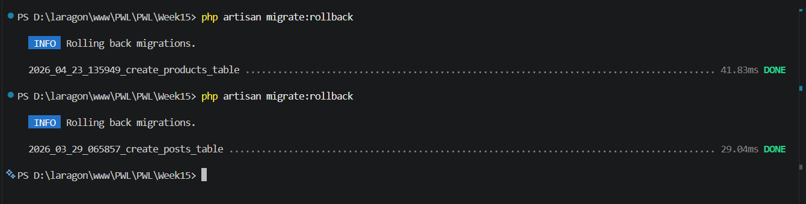 
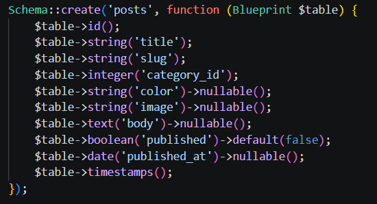 
**E. Membuat Tabel Tags**
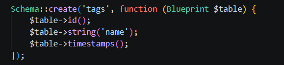 
**F. Membuat Pivot Table**
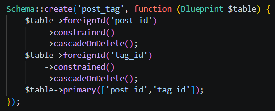 
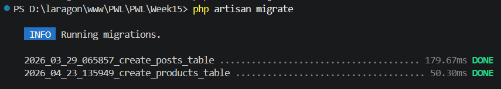 
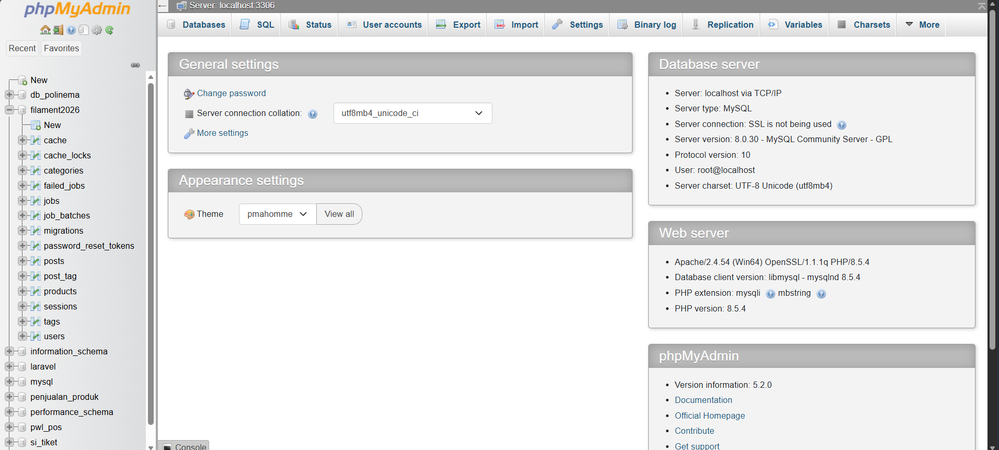 
**G. Membuat Resource Tag pada Filament**
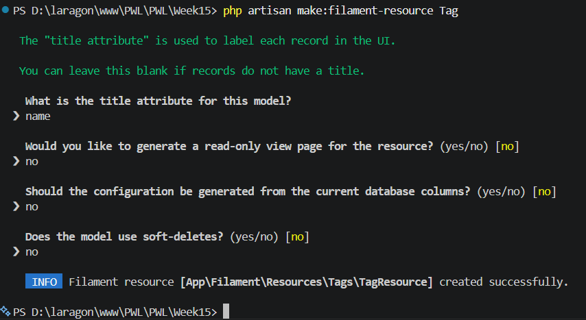 
**H. Membuat Model Tag**
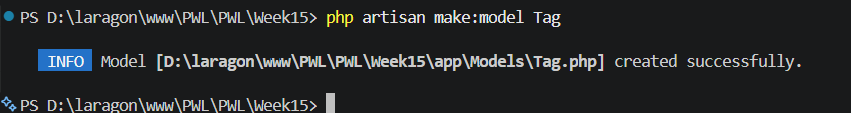 
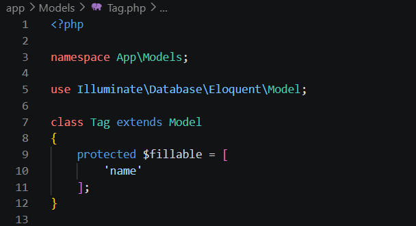 
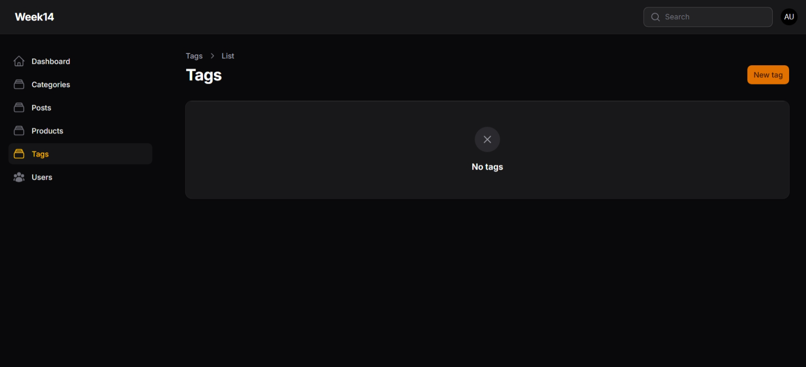  
Form Tag 
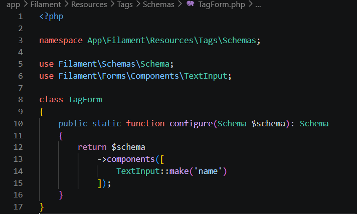 
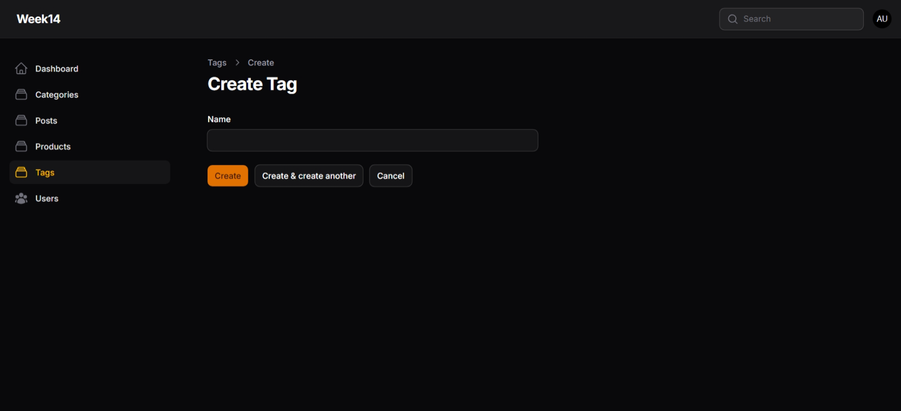  
Table Tag 
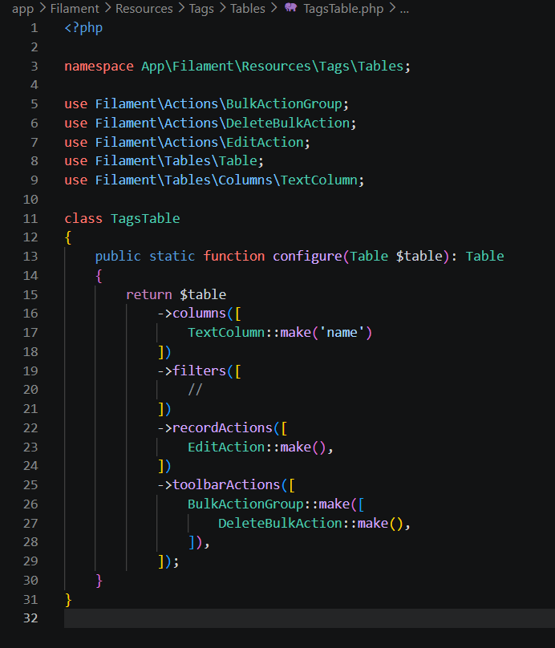 
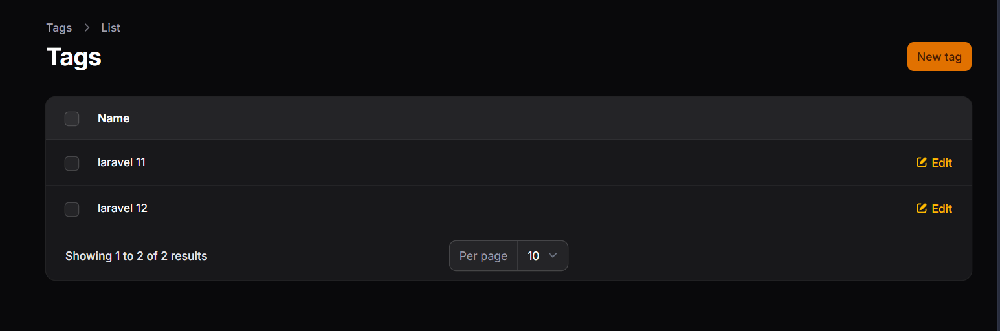 
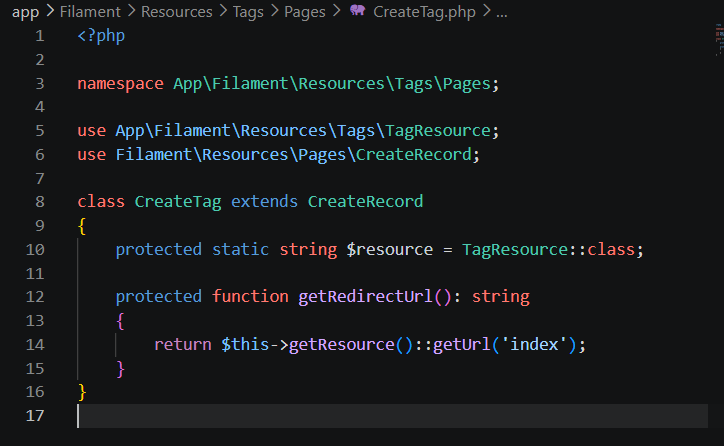 
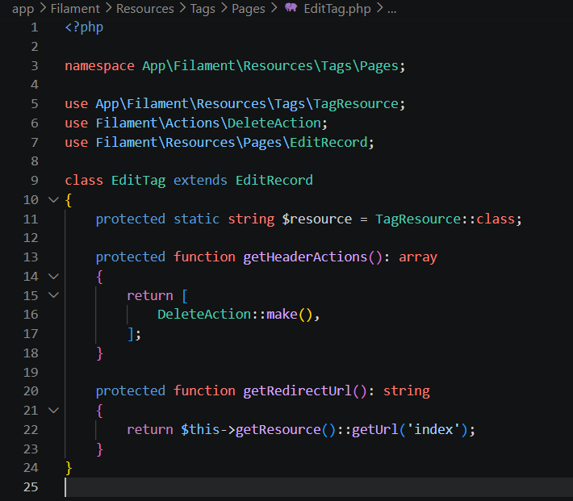 
**I. Menambahkan Relationship pada Model Post**
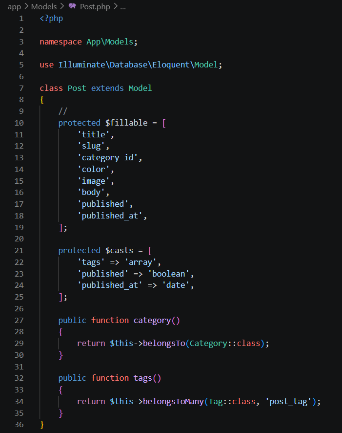 
**J. Menambahkan Relationship pada Model Tags**
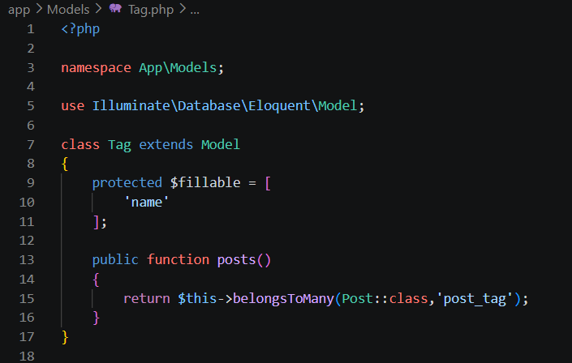 
**K. Menggunakan Relationship pada Form Post**
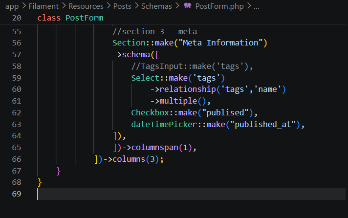 
**L. Hasil Form Post**
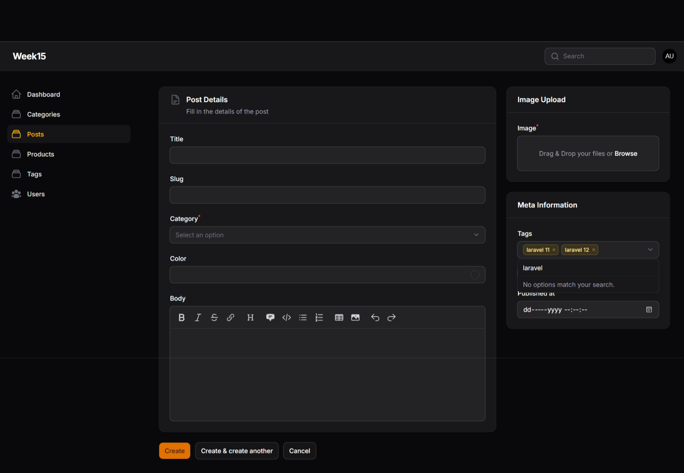 
**M. Membuat Relationship Manager**
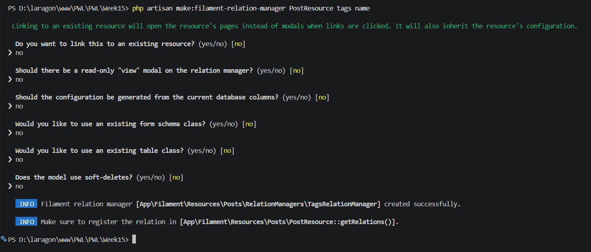 
**N. Menghubungkan Relationship Manager**
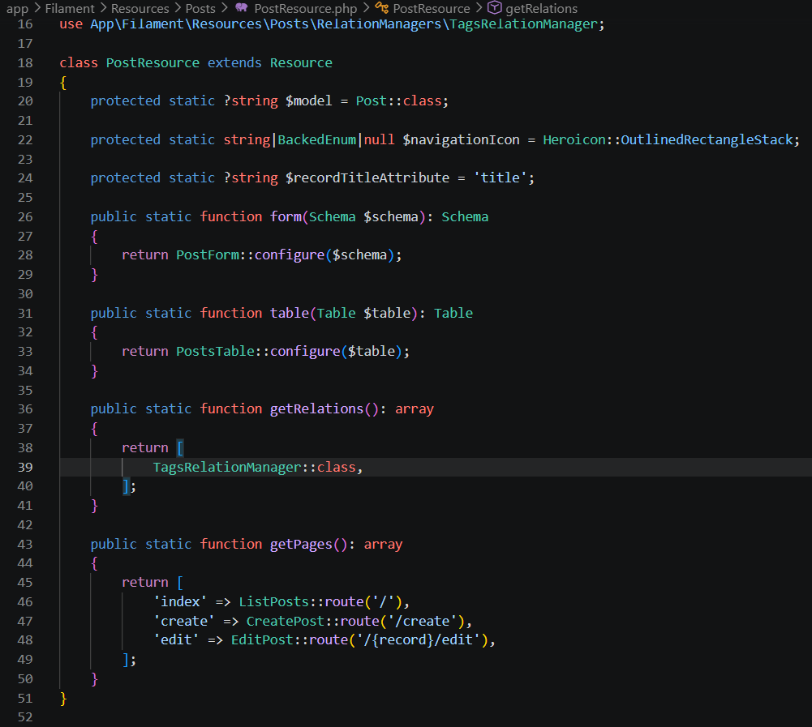 
**O. Fitur Relationship Manager**
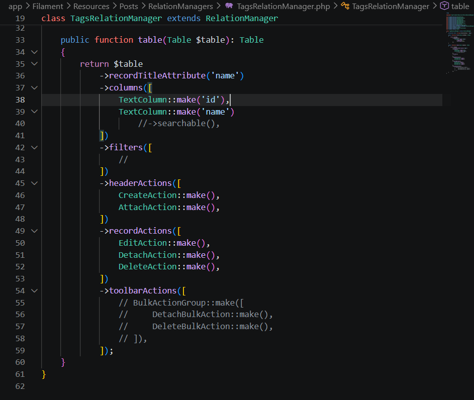 
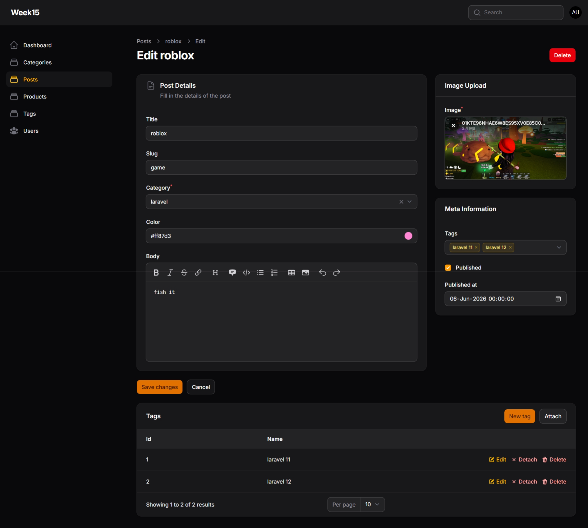 

</blockquote>

 

<b>Analisis & Diskusi</b>

 
<blockquote>

**1. Apa perbedaan HasMany dan Many-to-Many?**
 
Jawab : 

- HasMany (One-to-Many): Hubungan di mana satu data induk bisa memiliki banyak data anak, tapi setiap data anak hanya boleh terikat pada satu induk saja. Contohnya, satu Kategori bisa punya banyak Post, tapi satu Post tidak bisa masuk ke banyak kategori sekaligus. Kolom penghubungnya disimpan langsung di tabel anak.  
- Many-to-Many: Hubungan yang jauh lebih bebas, di mana banyak data di tabel A bisa terikat dengan banyak data di tabel B. Contohnya di jobsheet ini: satu Post bisa punya banyak Tag, dan di waktu yang sama, satu Tag juga bisa dipakai oleh banyak Post berbeda.  

**2. Mengapa pivot table diperlukan?**
 
Jawab : 
 

Pivot table wajib ada karena struktur database standar tidak bisa menghubungkan relasi Many-to-Many secara langsung tanpa merusak aturan data. Tabel pivot ini bertindak sebagai jembatan khusus di tengah-tengah yang hanya bertugas menyimpan pasangan ID dari kedua tabel utama (kolom post_id dan tag_id), sehingga hubungan antar-data yang rumit bisa tercatat dengan rapi dan efisien.

**3. Apa fungsi attach dan detach pada Filament?**
 
Jawab : 
 

- Attach: Digunakan untuk menghubungkan data yang sudah ada di tabel tujuan ke data induk yang sedang kita edit. Tombol ini hanya akan membuat catatan hubungan baru di dalam tabel pivot, tanpa membuat data baru di tabel utama.  
- Detach: Kebalikan dari attach, fungsinya untuk memutuskan hubungan antar-data. Filament akan menghapus baris penandanya di dalam tabel pivot, sehingga data tersebut tidak lagi saling terikat, namun data asli di tabel utama sama sekali tidak terhapus. 

**4. Mengapa JSON column kurang baik untuk relasi?**
 
Jawab : 
 

- Data Tidak Terstruktur: Menyimpan data dalam format JSON membuat database melanggar aturan normalisasi karena memasukkan banyak nilai ke dalam satu kolom tunggal.  
- Performa Query Lemah: Saat data aplikasi makin banyak, proses pencarian atau pemfilteran data berdasarkan tag tertentu akan sangat lambat karena database harus membaca teks JSON satu per satu di setiap baris.  
- Sulit Dimodifikasi: Jika ada nama tag yang salah ketik atau ingin diubah, kita terpaksa harus mengubah string teks di semua baris postingan secara manual, yang rawan membuat data jadi tidak konsisten dan rusak.

</blockquote>

 

---

Tahun Akademik 2025/2026
